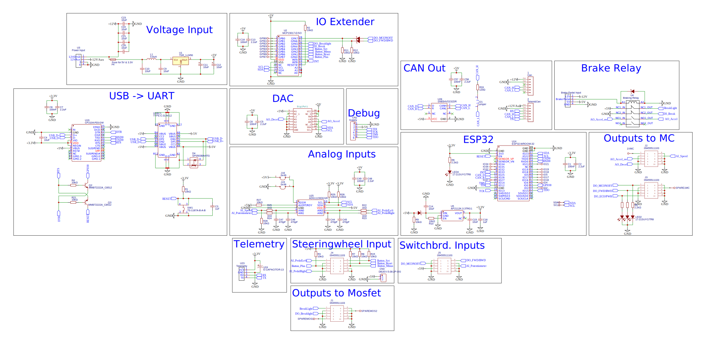

# solar_car_control_system_v3

---
(**Branch with state of Thun 2023 challange**](https://github.com/SolarEnergyRacers/solar_car_control_system_v3)
---

[solarenergyracers.ch](https://www.solarenergyracers.ch) - control system (two controller based control system for SER4)

## Folder Structure

```Text
.
├── AC
│   --> here comes the Auxiliary Controller
├── data
├── datasheets
├── DC
│   --> here comes the Dreive Controller
├── docs
├── drafts
├── extras
│   └── automation
└── XX --> minimal development area before divideing ing in AC and DC
    ├── include
    ├── interfaces
    └── src
        └── lib
            ├── ADC
            ├── CAN
            ├── CarControl
            ├── CarState
            ├── Console
            ├── DAC
            ├── Helper
            ├── I2CBus
            └── System
```

## Draft for Electro Schema

- 
- 
- 
- 
- 

## Documentation and Data Sheets

- [Signal Flows](docs/SignalFlows.md)
- [CAN Signal](docs/CAN_Signals.md)
- 
- 
- 
- 
- 

