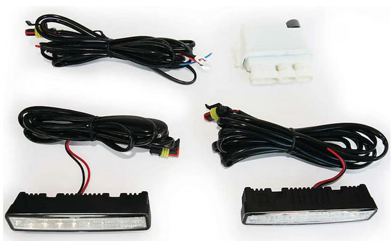
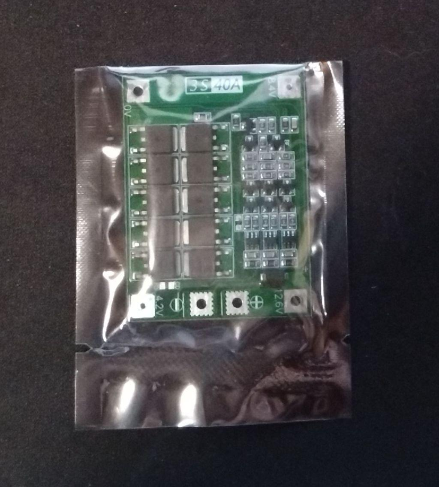

# SER-5, Vorbereitung ESC 2024, Zolder

[TOC]

## Elektrik

### Bestellen

- [x] Blinker  → Haltern Seite gedruckt, hinten Aufnahme vorbereitet, vorne noch offen;  genügend Material ?
- [x] Rücklichter/Bremslichter  → Aufnahme vorbereitet, in Haube noch offen
- [ ] Frontscheinwerfer  → Halterungen drucken, Deckel noch nicht ausgesägt, aber angezeichnet
  - [Philips Daylight Tagfahrlicht](https://www.galaxus.ch/de/s4/product/philips-daylight-9-led-tagfahrlicht-autolampe-3515199)  ****→_Damian bstellt_****  
  
- [x] Greenlight
- [x] Rückfahrkamera (Aus SER4)
- [ ] Geschirmte Netzwerkkabel
- [x] Signalhorn  -> Alu Halterung in Haube vorhanden, evtl fest auf Chassis ?
- [x] MPPTs  -> 1x Elmar vorhanden, Installation Chassis zwischen zwei Lenkspanten ?
- [ ] MPPT-Adapter, Programmiersoftware, Firmwarefiles
- [ ] CAN Buskabel (DC-AC, DC-BMS, BMS-MS): [TODO:Damian]()
- [ ] CAN Busadapter zum Einabu in Batteriekiste: [TODO:Damian]()
- [ ] Taster Notaus + Taster Bremspedal  -> Bremse/Bremspedal noch nicht festgelegt: [Taster TODO:Damian](), 4+2Stk.**→Damian bestellt**
- [ ] Lenkradkuppling  -> 1x vorhanden, Achtung möglicherweise anderes Lochbild
- Stecksystem für > 120A Cont.
  - [ ] Stecker: [TRU COMPONENTS 120 A Hochstrom-Batteriesteckverbinder](https://www.digikey.ch/de/products/detail/anderson-power-products-inc/6810G1-BK/10650491), 3 Stk.**→Damian bestellt**
  - [ ] Crimpcontakte: [TRU COMPONENTS Crimpkontakte für 120](https://www.digikey.ch/de/products/detail/anderson-power-products-inc/1319G4-BK/10650178), 8 Stk.  **→Damian bestellt**
- [ ] Batterietrennschalter 120A, 2-polig: [EA2-B0-16-912-22A-BC | DigiKey Electronics](https://www.digikey.ch/de/products/detail/carling-technologies/EA2-B0-16-912-22A-BC/15287086), 1 Stk. **→Damian bestellt**
- Doppelt isolierte Kabel BAT-MC, PV-BAT:
  - [ ] ~~(16mm2), 10m:~~
  - [x] (10mm2), 20m: ** →Damian bstellt ** bei Felix
  - [ ] Shunt für BMS (250A für Umax=50mV): [digikey.ch](https://www.digikey.ch/de/products/detail/bourns-inc/RSB-500-100/4967080)**→Damian bestellt**
  - [ ] vorkonvektionierte (Litze+Buchse) CMU Kabel:**→Damian bestellt**
  - [ ] Molex CAN Bus Kabel, vorkonvektioniert (aus SER-4)
  - [ ] DC-DC Wandler: [digikey.ch](https://www.digikey.ch/de/products/detail/murata-power-solutions-inc/MEV3S1212SC/2126404)**→Damian bestellt**
  - [ ] AUX-Batterie: Check gegen leere Batterie, DC-DC schützen

### Machen

- [ ] Batterie bauen
- [ ] Batterie einbauen
- [ ] Ladegerät bauen
- [ ] Ladegerät testen
- [ ] Rücklichter einbauen
- [ ] Fronlichter einbauen
- [ ] Green-Light einbauen
- [ ] Blinker einbauen
- [ ] PV einbauen
- [ ] PV verkabeln
- [ ] Bremspedal: Taster erhöhen und Platte über Taster kleben, aber _1/3 tasterloser Bereich zum Anfahren am Berg_ 
- [ ] MPPTs einbauen  -> Besprechung MI
- [ ] Befestigung DC   -> Besprechung MI
- [ ] Befestigung MC (sollte ok sein: Markus)  -> vorhanden
- [ ] Befestigung Switch-Board  -> Besprechung MI
- [ ] Befestigung Connector-Board  -> Besprechnung MI
- [ ] Rückfahrkamera
- [ ] Funk x-bee Sender
- Verkabelung
- [ ] Lampen
- [ ] DC-AC-Switch-Connector
- [ ] MPPTs
- [ ] Rückfahrkamera Signal und Energie
- [ ] x-bee
- Software
- [ ] Stabilität
- [ ] Bidirektionaler Funk
- [ ] Telemetrie

### Diskussion 2024.08.18
#### Auxilary Battery

- vorhandene neue Zellen (21700  oder Samsung 50e, 3 Stück seriell: 12V)
- BMS sendet Tobias an Damian:

#### Ladestrom angeboten von Zolder

- 16A
  - [ ] ~~Anfrage 32A möglich?~~

### Diskussion 2024.08.25

Bestellung macht Damian - Danke!

### Termine 

| Wann                                                       | Wer             | Was      |
| ---------------------------------------------------------- | --------------- | -------- |
| laufend                                                    | Remo, Karlheinz | Software |
| laufend                                                    | Damian          | Batterie |
| 06.09.2024, ab 18Uhr 07.+ 09.09.2024, jeweils ab 9Uhr | Alle            | Montage  |

