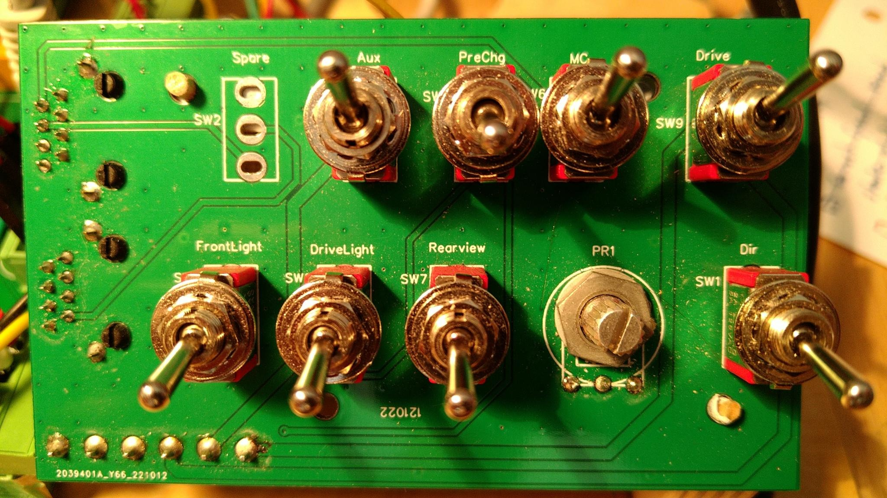
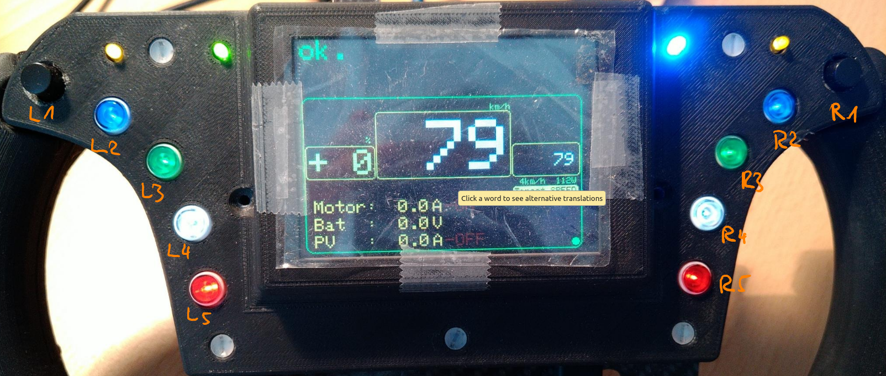
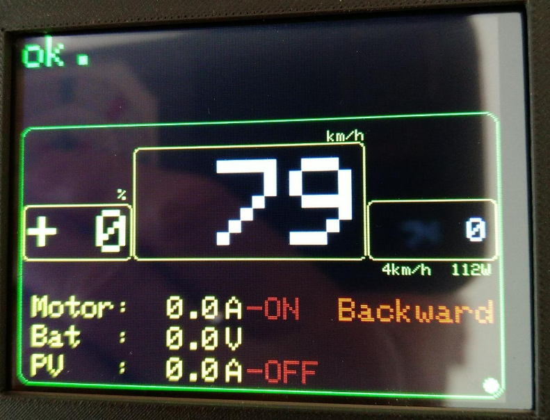

# SER4 Drivers Manual

## Preparation

## Control Elements

### Mainboard

(nothing to do by the driver)

### Emergency Controls

TODO: DESCRIBE IT!

### Switch Board

| Switch Name | Function (what is switched)        | Driver Screen / Steering Wheel | Engineer Screen |
| ------------- | ------------------------------------ | --------------- | ----------------- |
| Spare | - | - | - |
| Aux | AC (auxiliary controller) power on (up) / off (down) | %            | %              |
| PreChg |  | no | no |
| MC   | MC (motor controller)  power on/off | yes (right from Motor current) | yes           |
| Drive       | DC (drive controller) power on (up) / off (down)       | %                                             | %               |
| FrontLight  |                                                        | Right blue LED                                |                 |
| DriveLight  |                                                        | Left yellow LED                               |                 |
| Rearview    | Rear view camera power on (up) / off (down)            | no                                            | no              |
| PR1         | Aggressiveness / sensitivity of the PLUS/MINUS buttons | yes (below target speed)                 | no              |
| Dir | Drive direction forward / backward | yes if backward (red below target speed) | no |

### Steering Wheel

| Button | Name                   | Function                                                     |
| ------ | ---------------------- | ------------------------------------------------------------ |
| L1     | left indicator on/off  |                                                              |
| R1     | right indicator on/off |                                                              |
| L1+R1  | Hazard warning lights  |                                                              |
| L2     | MINUS                  | decreases acceleration, switch on constant mode, current speed/power is overtaken as target speed |
| R2     | PLUS                   | increases acceleration, switch on constant mode, current speed/power is overtaken as target speed |
| L3     | const. off             | switches off the constant mode, resets the PID (constant controller) |
| R3     | const. on              | switches on the constant mode, overtake last used target speed/power |
| L4     | SPEAK                  | driver speak button for radio communication                  |
| R4     | Const/Mount            | Driver screen: switches between speed and power constant mode Engineer screen: mounts or unmounts the sd-card |
| L5     | Horn                   | blows the cattle off the road                                |
| R5     | Next Screen            | switches between Driver and Engineer screen                  |

## Car Start

### Boot Screen

The bootscreen with black font on white background shows the initialization of all devices controlled by the AC car control system.

At least the display holds for a few seconds countdown to allow an additional check of the values.

### Main Driver Screen

### Engineering Screen

TODO

### Control Mode

Press button P2 until *button mode* is displayed on screen below the acceleration.

 Button        | Function
---|---
PLUS | decrease deceleration (recuperation) ... increase acceleration
MINUS | decrease acceleration ... increase deceleration (recuperation)
ADJUST | toggle between 1 unit and 10 unit steps for plus and minus
Break press | max break deceleration (recuperation)
Break release | set acceleration to 0 (neither recuperation nor acceleration)
 |  

Constant mode off:

- PLUS overtakes current speed
- MINUS overtakes current speed

Constant mode on:

- PLUS increments without overtaking recent speed
- MINUS decrements without overtaking recent speed

### Paddle Control Mode

The paddles are used to control the acceleration and deceleration (recuperation) values send to the motor controller (MC).

They are force sensitive: The more you pull them, the greater the setting value. 

Press button P2 until *paddles mode* is displayed on screen below the acceleration.

#### Adjust Paddles

After each start the paddles must be adjusted. Until that the acceleration is locked. It is shown by the number `-99` in the `acceleration/deceleration` display and the drivers information Acceleration still locked.

Procedure:

- Press Button paddle adjust `ADJ`
- Move both paddles at same time slow from min to max to min.
  You have about 5s for that.
- If successful the `acceleration/deceleration` display show `+ 0`
  Otherwise repeat the complete procedure.

During the race:

If you release both paddles and the `acceleration/deceleration` display doesn't show `+ 0` the adjust procedure must be repeated.

If the control range of the paddles is to rough then the adjust procedure must be repeated.

## Car Operate

## Steering Wheel

### Buttons

#### Right / Left Indicators and Hazard Warning Lights

Press left or indicator (`left` or `right`)  button to switch indicators. The directions are displayed as yellow triangles on the display. Press again to switch off. 

To switch on hazard indicator (all indicators blinking) press both indicator buttons at the same time. The hazard lights are shown as red triangles on the display.

Switch of the hazard light by pressing again both indicator buttons at the same time.

#### Constant Mode

Constant mode is usable in paddle control mode and in classic control mode.

| Button                 | function                                         |
| ------------------------ | -------------------------------------------------- |
| SET (first time press) | set constant mode                                |
| SET (next time press)  | overtake current speed / power                   |
| RES                    | reset constant mode                              |
| PWR/SPD                | switch between constant power and constant speed |
| PLUS | increase the target speed |
| MINUS | decrease the target speed |

### Display

